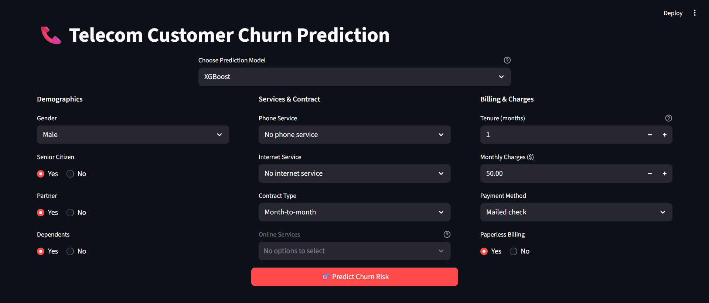
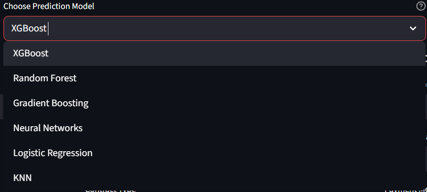
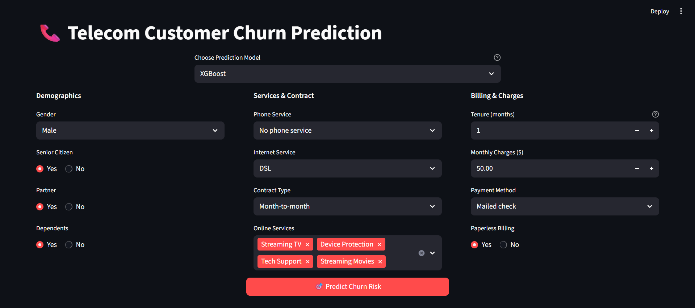
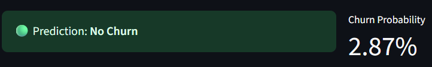

# Telecom Churn Prediction
  

## Overview
This project is an **optimized interactive Streamlit application** that predicts whether a telecom customer will churn using machine learning. The app leverages the **Telco Customer Churn dataset** from Kaggle and provides users with **multiple high-performance ML models** to choose from.

🚀 **[👉 Try the Live App Here](https://telco-churn-prediction-aniss.streamlit.app/)**

## ✨ Key Features
- **🤖 Multiple ML Models**: Choose from 6 different algorithms (XGBoost, Random Forest, etc.)
- **🎯 Real-time Predictions**: Instant churn probability with confidence scores
- **💡 Intelligent UI**: Dynamic form controls and enhanced user experience
- **🔧 Optimized Performance**: Efficient caching and error handling
- **📱 Responsive Design**: Clean, modern interface with better space utilization

## Dataset
**Source:** [Kaggle – Telco Customer Churn](https://www.kaggle.com/datasets/blastchar/telco-customer-churn?select=WA_Fn-UseC_-Telco-Customer-Churn.csv)

**Key features include:**
- **Demographics**: `gender`, `SeniorCitizen`, `Partner`, `Dependents`
- **Services**: `PhoneService`, `MultipleLines`, `InternetService`, `OnlineSecurity`, `StreamingTV`, etc.
- **Billing**: `Contract`, `PaperlessBilling`, `PaymentMethod`, `MonthlyCharges`, `TotalCharges`
- **Target**: `Churn` (Yes/No)

## Data Preprocessing & Feature Engineering
Comprehensive data cleaning pipeline applied before modeling:

1. **Data Cleaning**:
   - Dropped `customerID`: irrelevant identifier
   - Dropped `TotalCharges`: perfectly correlated with `tenure * MonthlyCharges`
   - Dropped `PhoneService`: redundant (encoded in `MultipleLines`)

2. **Feature Encoding**:
   - **Ordinal encoding**: `Contract` (Month-to-month=0, One year=1, Two year=2)
   - **One-hot encoding**: `InternetService`, `PaymentMethod` (with dummy trap avoidance)
   - **Binary encoding**: All Yes/No features converted to 1/0
   - **Custom features**: `HasInternet`, `automatic_pay` flags

3. **Final Features**: 21 numerical features optimized for model performance

## 🚀 Machine Learning Models
The application offers **6 optimized models** with intelligent selection:

| Model | Algorithm | Best For |
|-------|-----------|----------|
| **XGBoost** ⭐ | Gradient Boosting | High accuracy, feature importance |
| **Random Forest** | Ensemble | Robust predictions, interpretability |
| **Gradient Boosting** | Boosting | Complex patterns, good performance |
| **Neural Networks** | Deep Learning | Non-linear relationships |
| **Logistic Regression** | Linear | Fast predictions, interpretability |
| **KNN** | Instance-based | Local patterns, simplicity |

**Model Training Details:**
- **Split**: 80% train / 20% test with stratification
- **Metrics**: Accuracy, Precision, Recall, F1-Score, ROC AUC
- **Persistence**: Models saved as optimized `.pkl` files using joblib
- **Validation**: Cross-validation and hyperparameter tuning applied

## 🎨 Enhanced App Interface

### 1. **Smart Model Selection**
- Dropdown with optimized model ordering (XGBoost as default)
- Real-time model loading with error handling
- Performance hints for model selection

<p align="center">
  
</p>

### 2. **Intelligent Input Form**
- **Organized sections**: Demographics, Services & Contract, Billing & Charges
- **Dynamic controls**: Online services automatically disabled without internet
- **Smart defaults**: Reasonable starting values for all inputs
- **Input validation**: Proper ranges and step values
- **Enhanced tooltips**: Helpful guidance for each field

<p align="center">
  
</p>

### 3. **Advanced Prediction Results**
- **Visual indicators**: Color-coded risk levels (🟢 Low Risk / 🔴 High Risk)
- **Confidence scoring**: Probability percentage with model confidence

<p align="center">
  
</p>


## 📦 Installation & Setup

### Prerequisites
- Python 3.8+
- pip package manager

### Quick Start
```bash
# Clone the repository
git clone https://github.com/GuechtouliAnis/Telco-churn-prediction
cd Telco-churn-prediction

# Create virtual environment
python -m venv venv

# Activate environment
source venv/bin/activate   # Linux/Mac
# or
venv\Scripts\activate      # Windows

# Install dependencies
pip install -r requirements.txt

# Run the application
streamlit run app.py
```

## 📁 Project Structure
```
Telco-churn-prediction/
├── data/
│   └── WA_Fn-UseC_-Telco-Customer-Churn.csv
├── imgs/
│   ├── image1.png
│   ├── image2.png
│   ├── image3.png
│   └── image4.png
├── model/
│   ├── gbc_model.pkl
│   ├── knn_model.pkl
│   ├── logreg_model.pkl
│   ├── nn_model.pkl
│   ├── rft_model.pkl
│   └── xgb_model.pkl
├── src/
│   ├── funcs.py
│   └── preprocessing.py
├── .gitignore
├── 1_data_exploration.ipynb
├── 2_data_visualization.ipynb
├── 3_model_training.ipynb
├── app.py
├── LICENSE
├── README.md
└── requirements.txt
```

## 🤝 Contributing
Contributions are welcome! Please feel free to submit a Pull Request. For major changes, please open an issue first to discuss what you would like to change.

## 📄 License
This project is licensed under the MIT License - see the [LICENSE](LICENSE) file for details.

## 👨‍💻 Author
**Anis Guechtouli**
- 📧 Email: [guechtoulianiss7@gmail.com](mailto:guechtoulianiss7@gmail.com)
- 💼 LinkedIn: [Connect with me](https://linkedin.com/in/anis-guechtouli)
- 🐱 GitHub: [@GuechtouliAnis](https://github.com/GuechtouliAnis)

---

⭐ **Star this repository if you found it helpful!**