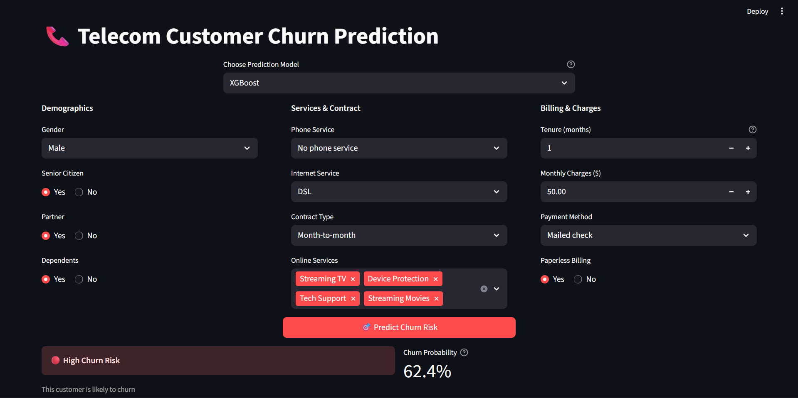

# Telecom Churn Prediction


## Overview
This project is an interactive **Streamlit app** that predicts whether a Telco customer will churn.  
It uses the **Telco Customer Churn dataset** from Kaggle and allows users to **choose among multiple machine learning models** for prediction.


## Dataset
**Source:** [Kaggle – Telco Customer Churn](https://www.kaggle.com/datasets/blastchar/telco-customer-churn?select=WA_Fn-UseC_-Telco-Customer-Churn.csv)

**Key features include:**
- Demographics: `gender`, `SeniorCitizen`, `Partner`, `Dependents`
- Services: `PhoneService`, `MultipleLines`, `InternetService`, `OnlineSecurity`, `StreamingTV`, etc.
- Billing: `Contract`, `PaperlessBilling`, `PaymentMethod`, `MonthlyCharges`, `TotalCharges`
- **Target:** `Churn` (Yes/No)


## Data Cleaning & Feature Engineering
Steps applied before modeling:
1. **Dropped `customerID`**: irrelevant identifier.  
2. **Encoding**:  
   - Ordinal: `Contract`  
   - One-hot: `InternetService`, `PaymentMethod` (dropped one dummy to avoid trap)  
   - Binary flags encoded as 0/1  
3. **Dropped `TotalCharges`**: perfectly correlated with `tenure * MonthlyCharges`.  
4. **Dropped `PhoneService`**: redundant, since `MultipleLines` encodes this info.  

**Final dataset**: numerical features (`tenure`, `MonthlyCharges`) + encoded categorical features + binary service flags.  


## Models Trained
The app provides a **selectbox** to switch between multiple models:

- Logistic Regression  
- Random Forest  
- Gradient Boosting  
- KNN  
- Neural Networks  
- XGBoost  

Each trained model is saved as a `.pkl` file (`joblib`) and loaded on demand.


## Model Training
- **Split:** 80% train / 20% test.  
- **Evaluation metrics:** Accuracy, Precision, Recall, F1, ROC AUC.  
- **Pipeline:** preprocessing → encoding → classifier (persisted with joblib).  
- **Note:** user can re-train models in the notebook if needed.


## App Interface
The Streamlit app provides an intuitive interface:

1. **Model Selection**  
   - Dropdown menu to choose the ML model (LogReg, Random Forest, XGBoost, etc.).

<p align="center">
  
</p>

2. **Input Features**  
   - **Demographics:** Gender, Senior Citizen, Partner, Dependents.  
   - **Services:** Phone Service (none/one/multiple), Internet Service (DSL/Fiber/None).  
   - **Online services:** multiselect for Online Security, Backup, Device Protection, Tech Support, Streaming TV/Movies (disabled if no internet).  
   - **Billing:** Contract type, Payment method, Paperless Billing.  
   - **Numerical inputs:** Tenure (months), Monthly Charges.

<p align="center">
  
</p>

3. **Prediction Output**  
   - Button: **"Predict Churn"**  
   - Shows result in color:  
     - 🟢 **No Churn**  
     - 🔴 **Churn**  
   - Displays churn probability as a percentage (metric card).

<p align="center">
  
</p>

## How to Run

### Development
```bash
# clone repo
git clone https://github.com/GuechtouliAnis/Telco-churn-prediction
cd Telco-churn-prediction

# create environment
python -m venv venv
source venv/bin/activate   # (Linux/Mac)
venv\Scripts\activate      # (Windows)

# install dependencies
pip install -r requirements.txt

# run app
streamlit run app.py
```

## License
This project is licensed under the MIT License. Feel free to use, modify, and distribute the code as needed.

## Author
Anis Guechtouli

## Contact
For any questions or suggestions, feel free to contact me at [guechtoulianiss7@gmail.com].